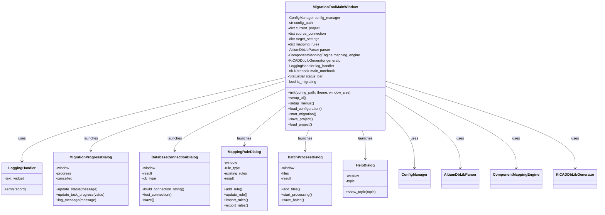
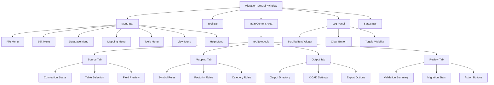
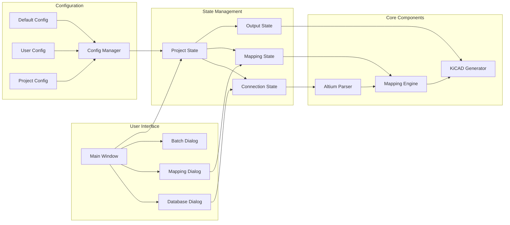
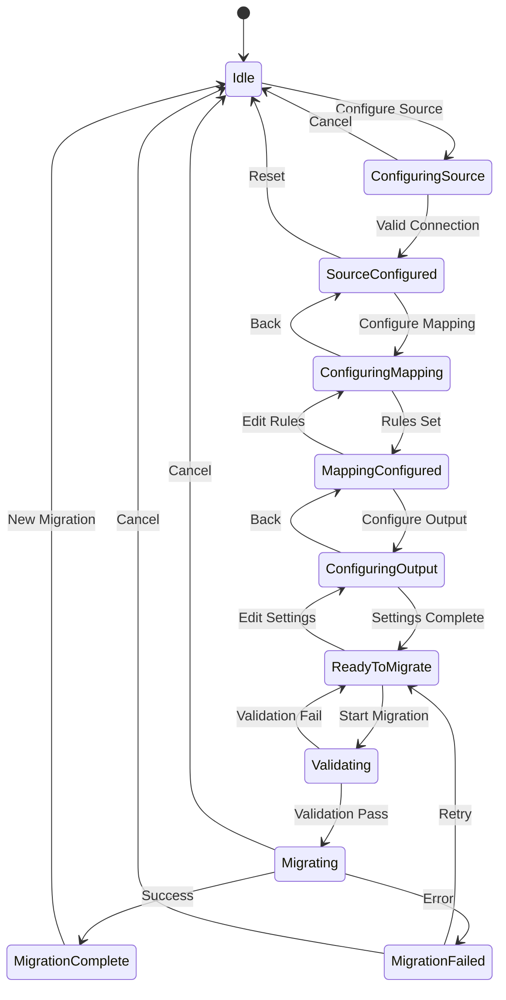
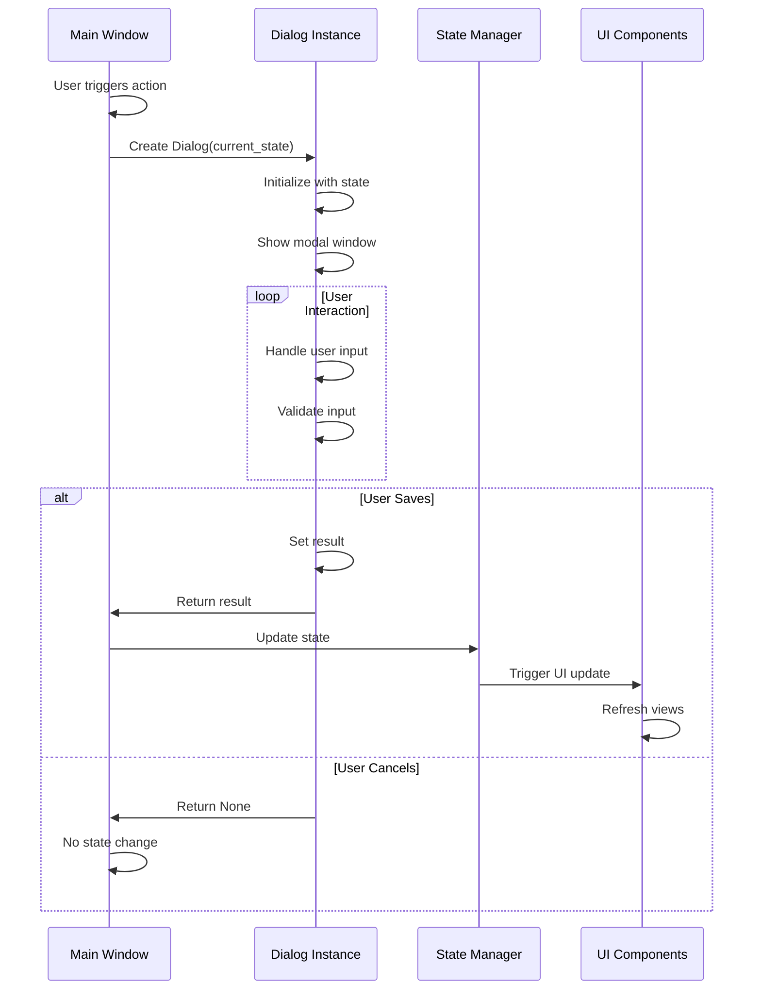
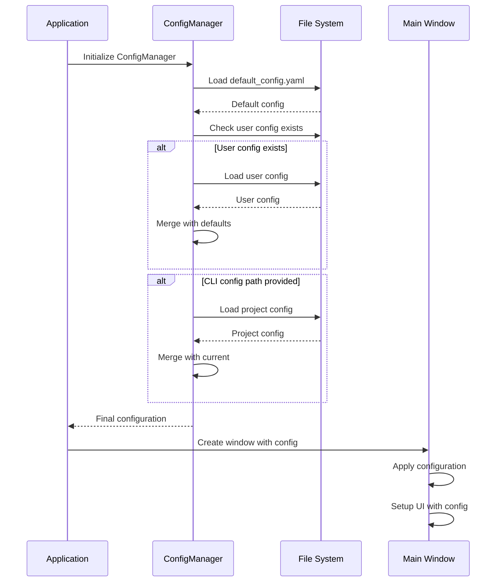
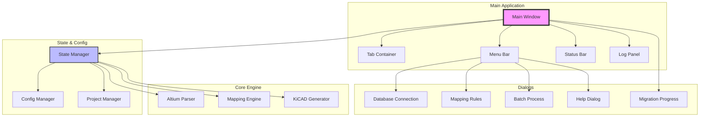

# Main Application Window Architecture Design

## Overview

This document describes the architecture design for the main application window of the Altium to KiCAD Database Migration Tool. The design provides a comprehensive GUI framework that integrates with existing dialog classes and provides a smooth user experience for database migration workflows.

## 1. Main Application Class Structure

### Class Name: `MigrationToolMainWindow`

**Inheritance:** 
- Inherits from `tk.Tk` (main window)
- Implements a state management pattern

### Key Attributes

```python
class MigrationToolMainWindow(tk.Tk):
    # Configuration Management
    config_manager: ConfigManager
    config_path: Optional[str]
    
    # State Management
    current_project: Dict[str, Any]  # Active migration project state
    source_connection: Optional[Dict[str, str]]  # Altium DB connection
    target_settings: Dict[str, Any]  # KiCAD output settings
    mapping_rules: Dict[str, Dict]  # Symbol, footprint, category rules
    
    # Core Components
    parser: Optional[AltiumDbLibParser]
    mapping_engine: Optional[ComponentMappingEngine]
    generator: Optional[KiCADDbLibGenerator]
    
    # UI Components
    log_handler: LoggingHandler
    main_notebook: ttk.Notebook
    status_bar: StatusBar
    
    # Migration State
    migration_thread: Optional[threading.Thread]
    is_migrating: bool
    migration_results: Optional[Dict]
```

### Key Methods

```python
# Initialization
def __init__(self, config_path=None, theme="system", window_size=(1024, 768))
def setup_ui(self)
def setup_menus(self)
def setup_logging(self)
def load_configuration(self, config_path=None)

# Dialog Management
def open_database_connection_dialog(self)
def open_mapping_rules_dialog(self, rule_type)
def open_batch_processing_dialog(self)
def show_help(self, topic="general")
def show_migration_progress(self)

# State Management
def save_project(self, path=None)
def load_project(self, path)
def reset_project(self)
def validate_migration_readiness(self)

# Migration Operations
def start_migration(self)
def cancel_migration(self)
def handle_migration_complete(self, results)

# Event Handlers
def on_closing(self)
def on_theme_change(self, theme)
```

## 2. UI Layout Design

### Main Window Structure

```
┌─────────────────────────────────────────────────────────┐
│ Menu Bar                                                │
├─────────────────────────────────────────────────────────┤
│ Tool Bar (Quick Actions)                                │
├─────────────────────────────────────────────────────────┤
│ ┌─────────────────────────────────────────────────────┐ │
│ │ Main Content Area (Notebook)                        │ │
│ │ ┌─────────────┬─────────────┬────────────┬────────┐│ │
│ │ │ Source      │ Mapping     │ Output     │ Review ││ │
│ │ ├─────────────┴─────────────┴────────────┴────────┤│ │
│ │ │                                                   ││ │
│ │ │ Tab Content Area                                  ││ │
│ │ │                                                   ││ │
│ │ └───────────────────────────────────────────────────┘│ │
│ └─────────────────────────────────────────────────────┘ │
│ ┌─────────────────────────────────────────────────────┐ │
│ │ Log Panel (Collapsible)                             │ │
│ │                                                      │ │
│ └─────────────────────────────────────────────────────┘ │
├─────────────────────────────────────────────────────────┤
│ Status Bar                                              │
└─────────────────────────────────────────────────────────┘
```

### Tab Organization

1. **Source Tab:**
   - Database connection configuration
   - Table selection
   - Field mapping preview
   - Quick stats (components found, etc.)

2. **Mapping Tab:**
   - Symbol mapping rules management
   - Footprint mapping rules management
   - Category mapping rules management
   - Confidence threshold settings
   - Mapping preview

3. **Output Tab:**
   - Output directory selection
   - KiCAD database settings
   - Field mapping configuration
   - Export options

4. **Review Tab:**
   - Pre-migration summary
   - Validation results
   - Mapping statistics
   - Migration action buttons

### Menu Structure

```
File
├── New Project
├── Open Project...
├── Save Project
├── Save Project As...
├── ─────────────────
├── Import Configuration...
├── Export Configuration...
├── ─────────────────
├── Recent Projects
├── ─────────────────
└── Exit

Edit
├── Preferences...
├── ─────────────────
├── Clear Log
└── Reset Settings

Database
├── Connect to Database...
├── Test Connection
├── ─────────────────
├── Refresh Tables
└── View Schema

Mapping
├── Symbol Rules...
├── Footprint Rules...
├── Category Rules...
├── ─────────────────
├── Import Rules...
├── Export Rules...
├── ─────────────────
└── Auto-Generate Rules

Tools
├── Batch Processing...
├── Validate Mappings
├── ─────────────────
├── Generate Report
└── Export Statistics

View
├── Theme
│   ├── Light
│   ├── Dark
│   └── System
├── ─────────────────
├── Show Log Panel
├── Show Status Bar
└── Full Screen

Help
├── Documentation
├── Getting Started
├── ─────────────────
├── Database Help
├── Mapping Help
├── Troubleshooting
├── ─────────────────
└── About
```

## 3. Integration Patterns

### Dialog Launch Pattern

```python
def open_dialog_pattern(self, DialogClass, **kwargs):
    """Standard pattern for launching modal dialogs"""
    dialog = DialogClass(self, **kwargs)
    self.wait_window(dialog.window)
    return dialog.result
```

### Data Flow Architecture

```
Main Window State
    ↓
Dialog (reads initial state)
    ↓
User Interaction
    ↓
Dialog Result
    ↓
Main Window State Update
    ↓
UI Update & Validation
```

### Event Handling

- Use observer pattern for state changes
- Dialogs return results via `dialog.result` attribute
- Main window validates and applies changes
- Triggers UI updates across all affected components

## 4. Configuration Management

### Configuration Hierarchy

1. Default configuration (from `default_config.yaml`)
2. User configuration (from home directory)
3. Project configuration (project-specific overrides)
4. Runtime configuration (CLI arguments)

### Configuration Loading Strategy

```python
def load_configuration(self, config_path=None):
    # 1. Load defaults
    config = self.config_manager.load_defaults()
    
    # 2. Merge user config
    user_config = self.config_manager.load_user_config()
    config = deep_merge(config, user_config)
    
    # 3. Merge project config if provided
    if config_path:
        project_config = self.config_manager.load_config(config_path)
        config = deep_merge(config, project_config)
    
    # 4. Apply to application state
    self.apply_configuration(config)
```

### State Persistence

- Auto-save project state on significant changes
- Save window geometry and UI preferences
- Maintain recent projects list
- Store last used directories

## 5. Implementation Strategy

### Phase 1: Core Structure
1. Create `MigrationToolMainWindow` class
2. Implement basic window setup and layout
3. Add menu bar and status bar
4. Implement configuration loading

### Phase 2: Tab Implementation
1. Create Source tab with database connection UI
2. Create Mapping tab with rules management
3. Create Output tab with settings
4. Create Review tab with summary

### Phase 3: Dialog Integration
1. Wire up existing dialogs to menu items
2. Implement data flow between dialogs and main window
3. Add state validation after dialog interactions

### Phase 4: Migration Workflow
1. Implement migration preparation and validation
2. Add progress tracking with MigrationProgressDialog
3. Handle migration results and error reporting
4. Add post-migration actions

### Phase 5: Polish & Features
1. Add keyboard shortcuts
2. Implement drag-and-drop support
3. Add context menus
4. Implement undo/redo for configurations
5. Add tooltips and status messages

### Entry Point Implementation

```python
def main(config_path=None, theme="system", window_size=(1024, 768)):
    """Main entry point for the GUI application"""
    # Create and configure main window
    app = MigrationToolMainWindow(
        config_path=config_path,
        theme=theme,
        window_size=window_size
    )
    
    # Start the application
    app.mainloop()
```

## 6. Architecture Diagrams

### Class Architecture Diagram



### UI Component Hierarchy



### Data Flow Diagram



### Migration Workflow State Machine



### Dialog Integration Pattern



### Configuration Loading Sequence



### Component Interaction Overview



## Key Design Benefits

1. **Clear Separation of Concerns**
   - UI logic separated from business logic
   - State management centralized
   - Configuration handling isolated

2. **Extensible Architecture**
   - Easy to add new tabs or dialogs
   - Plugin-friendly design
   - Clear integration points

3. **User-Friendly Workflow**
   - Step-by-step migration process
   - Clear visual feedback
   - Comprehensive help system

4. **Professional UI/UX**
   - Modern tabbed interface
   - Consistent dialog patterns
   - Real-time logging and status updates

5. **Robust State Management**
   - Project save/load functionality
   - Configuration persistence
   - Undo/redo capability (future enhancement)

This architecture provides a solid foundation for implementing the main application window while maintaining compatibility with existing components and allowing for future enhancements.